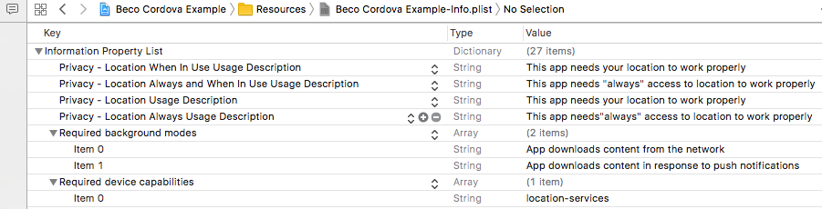

#  Beco Cordova SDK
_An Apache Cordova version of the Beco SDK with Android and iOS support._

The Beco SDK provides developers a rapid path towards Beco Beacon integration. While other solutions focus on providing a light wrapper to existing beacon APIs, the Beco SDK has taken the approach of providing a turn-key solution with a greatly simplified API, designed to let users leverage the power of the Beco Cloud service while being as easy to integrate as Beco Beacons are to deploy.

This README provides installation and usage instructions for developers deploying the SDK in their cross-platform Cordova application. Please read this entire document before developing with the Beco Cordova SDK. Additional details regarding the necessary additional project configuration steps for each OS can be found in our SDK User Guides, located in the "sdk_resources" repository of our GitHub.

## Table of Contents
- [Release Notes](#release-notes)
- [Prerequisites](#prerequisites)
    - [iOS Device Requirements](#ios-device-requirements)
    - [Android Device Requirements](#android-device-requirements)
- [Installation](#installation)
    - [Cordova Plugin Installation](#cordova-plugin-installation)
    - [iOS Project Configuration](#ios-project-configuration)
    - [Android Project Configuration](#android-project-configuration)
        - [Sample Permissioning Setup](#sample-permissioning-setup)
- [SDK Overview](#sdk-overview)
- [Using the SDK](#using-the-sdk)
    - [1) Initialization & Setup](#1-initialization--setup)
    - [2) Registering Handset](#2-registering-handset)
    - [3) Registering Event Callbacks](#3-registering-event-callbacks)
    - [4) Start/Stop Scanning](#4-startstop-scanning)
    - [5) Adjusting Advanced Performance Settings](#5-adjusting-advanced-performance-settings)
    - [6) Utility / Information Functions](#6-utility--information-functions)
    - [7) Additional Functionality](#7-additional-functionality)
- [Nuances](#nuances)
    - [Simulator Usage](#simulator-usage)
    - [Bluetooth Status](#bluetooth-status)
    - [Long-Term Analytics](#long-term-analytics)
- [Example Application](#example-application)
- [Developing](#developing)
- [Legal](#legal)
    - [License](#license)
    - [Export Statement](#export-statement)
    - [Trademark Notes](#trademark-notes)

## Release Notes

v1.0.6 _BETA_ - Updated Beco Android SDK to v1.9 (13). This deprecates support for iOS prior to 10
and Android versions prior to API 22. Expanded Documentation.

v1.0.5 _BETA_ - Updated Beco SDK for iOS to v3.5.15. Note: The "Server Parsing Error" return value has been added for the 'onReportError' callback function. See "Using the SDK" section of this document.

v1.0.4 _BETA_ - Updated Beco SDK for iOS to v3.5.12.

v1.0.3 _BETA_ - Updated Beco SDK for Android to v1.9(12), Beco SDK for iOS to v3.4.0

v1.0.2 _BETA_ - Updated Android API to v1.8.9.

v1.0.1 _BETA_ - Updated Android API to v1.8.6.

v1.0.0 _BETA_ - Initial release of the Beco Cordova SDK. Includes support for Android and iOS.
This version of the plugin supports realtime location data and long-term analytics data collection.
The plugin is currently in BETA, and functionality may change in future releases.

## Prerequisites
The Beco Cordova SDK has been tested using Apache Cordova version 8.0.0.

#### iOS Device Requirements
The Beco SDK for iOS requires a Bluetooth 4.0 (BLE, Bluetooth Smart) compatible iOS device running
at least iOS 10.0.
We have tested extensively on the iPhone 5s, iPhone 6/6+, iPad Mini and iPad Air 2 on both iOS 10.x and 11.x.
We expect other iOS devices and versions to work similarly, but they have not been tested by Beco.
The SDK has been built with Universal (iPhone® and iPad®) support.

Releases after v1.0.5 _BETA_ deprecate support for iOS 9.x.

#### Android Device Requirements
The Beco SDK for Android requires a Bluetooth 4.0 (BLE, Bluetooth Smart) compatible
Android device with Android Lollipop (5.1), API Level 22+.
Beco *strongly* recommends devices running Android 6.0.1 (Marshmallow, API 23) or later due to substantial
Bluetooth bugs in older versions of the operating system.
We observe that that Android does frequently exhibit device and OS specific behavior and
interested parties should contact us for further details.

Releases after v1.0.5 _BETA_ deprecate support for Android versions prior to API 22.

## Installation

#### Cordova Plugin Installation

The Beco Cordova SDK can be installed in your project using the following command:
```
    cordova plugin add https://github.com/becoinc/beco_cordova_sdk.git#master
```
Once you have added the plugin, run `cordova build` to update the platform-specific project files to reflect the changes.

#### iOS Project Configuration
There are several platform-specific settings that must be configured to deploy an application using the Beco Cordova SDK on iOS.

*1.* In the capabilities section of your app’s main target configuration, you need to declare the following for the Beco SDK:


*2.* The following keys must be set in the `Info.plist` file:

|Key|Value(s)|
|---|---|
|UIBackgroundModes|`fetch`, `remote-notification`|
|UIRequiredDeviceCapabilities|`location-services`|
|NSLocationAlwaysUsageDescription|`This app needs your location in order to work properly.`|

**Note:** In the above chart, commas indicate an array of values.

You may change the NSLocationAlwaysUsageDescription if you'd like to alter the message that appears to users when
requesting location permission.

**Note:** On certain versions of iOS (i.e. 11) we've found that other keys are necessary for location permissions.
Beco strongly recommends using **all** the indicated privacy keys.

These are shown in below in a snapshot from the XCode 9 Info.plist UI.


*3.* You must enabled the **"Always Embed Swift Standard Libraries"** build flag.

*4*. In order to work around an app store submission bug, documented here in Radar: http://www.openradar.me/radar?id=6409498411401216,
you need to add the following shell script execution to the “Build Phases” section of your app build.
```
    bash "${BUILT_PRODUCTS_DIR}/${FRAMEWORKS_FOLDER_PATH}/BecoSDK.framework/strip-frameworks.sh"
```


#### Android Project Configuration
There are several platform-specific settings that must be configured to deploy an application using the Beco Cordova SDK on Android.

*1*. Ensure that the `Android` section of your `config.xml` includes the proper
tags to set the `AndroidManifest.xml` SDK versions:
```xml
<platform name="android">
    <allow-intent href="market:*" />
    <preference name="android-minSdkVersion" value="22" />
    <preference name="android-targetSdkVersion" value="23" />
</platform>
```

Alternately, you can directly set the `<uses-sdk>` tag in the `AndroidManifest.xml`
directly.
ex:
```xml
    <uses-sdk android:minSdkVersion="18" android:targetSdkVersion="23" />
```

*2*. Android's recent changes to the Permissions system require the application to request permissions at runtime,
 which is outside the scope of the Beco Cordova SDK. The SDK requires the `ACCESS_COARSE_LOCATION` permission.
 The developer may configure android permissioning via an existing plugin, as demonstrated below, or by developing
 their own plugin to show a custom permission dialog.

*3*. Make sure you have Gradle installed and in your path. The cordova plugin for Android appears to use
 Gradle to generate the gradle wrapper scripts in the project when Android is added.
 We use homebrew to install Gradle (i.e. `brew install gradle`).
 This is a *new* requirement with the Cordova Android platform of 7.0.0. Homebrew installs Gradle 4.5.1.

*Note:* In order to support Android Studio 3.0.0 and newer you must be using v6.x.x or newer of the Android Cordova platform
plugin. Details on migrating are available at
[https://cordova.apache.org/announcements/2017/11/09/android-release.html](https://cordova.apache.org/announcements/2017/11/09/android-release.html).

##### Sample Permissioning Setup
A simple way to enable Android permissioning is via the `cordova-plugin-android-permissions` plugin, which provides a
JS interface for the Android SDK's permissioning system.

To install `cordova-plugin-android-permissions` in your project, run the following cordova command in your project directory:
```
cordova plugin add cordova-plugin-android-permissions
```

Then, somewhere in your application code, request permission using the following code, optionally passing in
success/error callbacks to run code based on whether the application has the correct permissions. A good place to
request permission is after calling `registerHandset` and before calling `startScan`.
```javascript
var permissions = cordova.plugins.permissions;
permissions.requestPermission(permissions.ACCESS_COARSE_LOCATION, success, error);
```

If permission is already granted, the method will silently pass. If no permissions are granted, it will
display a dialog. If the app does not have location permissions when the `startScan()` method is called,
the `reportStartScanComplete` event will return an error code. The usage of this plugin is documented in
the example application.

## SDK Overview

This section outlines the core functions of the Beco Mobile SDK. Specific usage and details of the individual
 functions overviewed here is covered in the next section: “Using the Beco SDK."

**Note:** Many of the SDK's functions operate asynchronously in the background thread. Because of this, they do not
return data directly, and instead use callback functions in a similar format to many other JS frameworks.
See subsection "Registering Event Callbacks" under the next section: "Using the SDK."

#### Core
Used to initialize the SDK, configure and authorize SDK credentials and handset metadata, and start/stop the beacon detection system.
```javascript
BecoCordovaPlugin.setCredentials(hostname, username, password);
BecoCordovaPlugin.registerHandset(handsetId, personId, groupId, userData, successCallback, failureCallback);
BecoCordovaPlugin.startScan();
BecoCordovaPlugin.stopScan();
BecoCordovaPlugin.getHSID(function(hsid){...});
```
#### Event Callback Functions
Used to register callback functions that will be called periodically in response to events generated by the SDK,
 including real-time location updates and error reports.
```javascript
BecoCordovaPlugin.onReportStartScanComplete(function(data){...});
BecoCordovaPlugin.onReceiveLocationData(function(data){...});
BecoCordovaPlugin.onReportAppHit(function(data){...});
BecoCordovaPlugin.onReportError(function(data){...});
```
#### Advanced Performance Settings
Used to view or modify adjustment variables meant to tweak the performance of the SDK.

**NOTE:** The SDK has pre-set default values to ensure reliable indoor positioning performance.
There are very rare cases where these defaults may need adjustment, and even then should only be modified
 after review with our Support Team in order to preserve system performance. Open a ticket via support@beco.io
  if you experience unexpected location performance.
```javascript
BecoCordovaPlugin.setThresholdAdjustment(value);
BecoCordovaPlugin.getThresholdAdjustment(function(data){...});
BecoCordovaPlugin.setRefreshInterval(value);
BecoCordovaPlugin.getRefreshInterval(function(data){...});
```
#### Utility / Information
Used to get various information from the SDK.
```javascript
BecoCordovaPlugin.getVersion(function(data){...});
BecoCordovaPlugin.getPlatformVersion(function(data){...});
```

## Using the SDK
The following is a detailed breakdown of each individual function of the Beco Mobile SDK, presented in the
 appropriate code flow order of operations.

#### 1) Initialization & Setup

Before using any other functionality of the SDK, your application must authenticate with the SDK. This is done using `setCredentials`.

```javascript
BecoCordovaPlugin.setCredentials(hostname, username, password);
```
- `hostname` set to “api.beco.io” to point to the Beco Cloud service. The hostname will only differ if you have
a private instance of the Beco Cloud.
- `username` refers to the SDK username that has been provided to you as part of your Beco Developer Credentials.
The first part of your Beco Service Account/Mobile SDK Credentials.
- `password` refers to the SDK password that has been provided to you as part of your Beco Developer Credentials.
 The second part of your Beco Service Account/Mobile SDK Credentials.

NOTE: The SDK username and SDK password should be hardcoded into your application, as these values are used to
 authenticate the SDK against your Customer Account and allow the application to decrypt the Beco Beacons in your
 network. The `registerHandset` function detailed below allows for enhanced spatial analytics with different
 levels of individual user visibility based on your desired use case.

#### 2) Registering Handset

After the App is first installed, you must register the handset with the Beco SDK. This function configures the
 handset for location positioning with the SDK.

```javascript
BecoCordovaPlugin.registerHandset(handsetId,
                                   personId,
                                    groupId,
                                   userData,
                    function success(){...},
                    function failure(){...});
```


> It is safe to call this function at every application startup. If the handset has already been registered, the function will silently skip the handset registration and call the success function.

The following are different values that can be registered with the SDK for each handset. The default, anonymous `handsetID` (HSID) assigned by the SDK is the only value required for the SDK to function. With an approach we call “Customizable Anonymity,” you have the flexibility to register one or both additional inputs beyond `handsetID` (`groupID` and/or `personID`) for enhanced analytics depending on your use case and desired level of analytics. If used, Beco recommends taking steps to anonymize this information to reduce the amount of PII pushed in to the Beco system (see [https://dev.beco.io/docs/privacy](https://dev.beco.io/docs/privacy)).

- `handsetId`: This parameter can be set to null/nil and will be auto generated by the SDK. On iOS, this will be the IDFV. On Android, this will be a randomly generated string of letters and numbers.

- `personId`: Use to identify each unique user. The personID is a plaintext string and therefore may be defined as most appropriate to your organization, e.g. an employee ID, user ID, or similar internal identifier. It is important that this value stays constant across sessions in order for correct analytics data to be generated. Whatever ID you choose will be searchable via the Occupancy API. If no personID is specified, the handsetID will be used. See dev.beco.io for more information on levels of analysis and privacy.

- `groupId`: Use to assign users to an internal group e.g. their department, role, or similar group level identifier. The groupID is a string and therefore may be defined as most appropriate to your organization. It is important that this value stays constant across sessions in order for correct analytics data to be generated. See dev.beco.io for more information on levels of analysis and privacy.


- `userData`: A handset can have arbitrary user provided (JSON) data attached to it. This data can be added or modified using our PATCH endpoint and retrieved later using the Beco Web API endpoints. If this is not relevant, null/nil is an acceptable answer.


#### 3) Registering Event Callbacks
The Beco Mobile SDK returns real-time location data using callback functions. The SDK will call the callback functions each time new data is generated for the corresponding event. By using these event callback functions, you can obtain real-time location data from the SDK.

>It is recommended that you register callback functions before calling `startScan` (next section) so that your application does not miss any events.

The following events are supported:

|Event Name|Callback Setter Function|
|---|---|
|reportStartScanComplete|`BecoCordovaPlugin.onReportStartScanComplete(function(data){...})`|
|reportAppHit|`BecoCordovaPlugin.onReportAppHit(function(data){...})`|
|receiveLocationData|`BecoCordovaPlugin.onReceiveLocationData(function(data){...})`|
|reportError|`BecoCordovaPlugin.onReportError(function(data){...})`|

These events will now be described individually.

##### onReportStartScanComplete
This event will fire when the SDK has started scanning, and provides a way to diagnose the status of the beacon scanning system.The event data will be returned as a JS object, displayed here as JSON:

```JSON
{
    "statusCode" : 0,
    "statusString" : "Status String"
}
```

The following codes may occur:

|Status Code|Status String|Description|
|---|---|---|
|0|Success|The scan has started successfully.
|1|Unauthorized|The user has not authorized the app with the correct permissions yet.
|2|Bluetooth Off|Bluetooth is turned off. This event will not fire with the current API version (See "Nuances")
|3|Bluetooth Unsupported|Bluetooth is unsupported. This event will not fire with the current API version (See "Nuances")
|4|Bluetooth Unauthorized|Bluetooth is unauthorized. This event will not fire with the current API version (See "Nuances")
|5|Bluetooth Unknown|General Error Code
|6|Network Error|There is no cellular or WiFi connection available.
|7|Invalid Credentials|The SDK Credentials provided are invalid.
|8|Already Scanning|The SDK is already scanning for beacons.

##### onReportAppHit **(DEPRECATED)**
This event will return a Beco Beacon ID corresponding to the closest beacon to the phone's location. This event is called as soon as the SDK detects a beacon and before it sends the data to the Beco Cloud to obtain more detailed information. **This event is deprecated**, and is currently disabled on Android. To access realtime location hits, please use the onReceiveLocationData event.

##### onReceiveLocationData
This event will return real-time location data based on the SDK’s beacon detection. You may get the same location data sent multiple times as a status refresh. When no location data is available, or the location is ambiguous, the event will receive a null/nil object.

The SDK may report an unknown location for one of several reasons:

* You may be out of the reliable range of your registered Beco Beacons.
* The RF environment is such that your location is ambiguous. You are neither here nor there and the SDK is informing you of that situation.
* The phone does not have an available Internet connection and you have changed locations.

The location data will be returned as a JS object, displayed here as JSON:

```JSON
{
    "becoId" : "XXXXXX",
    "hsid" : "XXXXXX",
    "place" : {
        "placeName" : "Place Name",
        "placeId" : "XXXXXX",
        "comments" : null,
        "capacity" : 0,
        "floor" : {
            "name" : "Twelfth Floor",
            "floorId" : 12
        },
        "location" : {
            "locationName" : "Location Name",
            "locationId" : "XXXXXX"
        }
    }
}
```
Many of these fields are editable via the Beco Portal, and would have been set during initial registration (“check-in”) of the beacon in the Beco Setup App during installation. Depending on the configuration of your beacon, some of these fields may be blank.

>If you are using real-time location data in your App, the use of `place.placeID` as an identifier is recommended. Using Beco IDs to determine location is not advised, since multiple beacons can be grouped in to a single Place.

##### onReportError
This event will fire when an SDK error/event has occurred. The error data will be returned as a JS object, displayed here as JSON:

```JSON
{
    "errorCode" : 0,
    "errorString" : "Error String"
}
```

The following errors may occur:

|Error Code|Error String|Description|
|---|---|---|
|0|Credential Mismatch|The SDK Credentials specified do not match the beacon scanned.|
|1|Customer Not Found|The SDK Credentials specified were not found as a customer.|
|2|Rate Limit Exceeded|The server has reported a rate limit violation.|
|3|Server Parsing Error|There was a problem with the Beco Cloud Services executing a command.|
|4|Server Communication failure|There was a problem communicating with the Beco Cloud Services.|
|5|Bluetooth Disabled|Bluetooth has been disabled. This event will not fire with the current API version (See "Nuances")|
|6|Bluetooth Enabled|Bluetooth has been reenabled. This event will not fire with the current API version (See "Nuances")|
|7|Location Disabled|Location Services have been disabled.|
|8|Location Enabled|Location Services have been reenabled.|

#### 4) Start/Stop Scanning

To start scanning for beacons, call the following command:

```javascript
BecoCordovaPlugin.startScan();
```
The Beco SDK will begin scanning for beacons in the background, and will periodically call the registered event callbacks.

>**In order for the SDK to function properly, you should call `startScan()` as soon as possible after your app has launched.**

Once you call `startScan`, the SDK will continue to scan for beacons in either the foreground or background (even when the App is swiped closed) until one or more of the following occurs:

* `stopScan` is called
* The phone restarts (it is device/OS version specific if scanning auto-restarts).
* The user force-stops the app (Android). This is not a swipe-close, it’s an App manager function. The SDK will continue in the background with the App simply swiped closed.
* The OS kills the app due to memory pressure. The OS may restart it once memory is available (device/OS version specific).

The SDK will stay running in the background and wake the phone up when possible to process beacon information when permitted by the OS. The following differences with background behavior have been observed based on the native power saving features of each OS:

**iOS:** The SDK will continue to run in the background indefinitely, and background startup will automatically resume upon device restart and passcode input (if applicable).

**Android:** The SDK will hit in the background for roughly fifteen minutes before the OS prevents the SDK from operating normally. Light user interaction with the device every fifteen minutes will sustain expected background behavior; less frequent interaction will result in inconsistent background behavior over time. This behavior is heavily dependent on OS version.

If you wish to stop scanning for beacons at some point in your App workflow (for example, if the user logs out of your App), that is when you would call `stopScan`.

>It is recommended that you do not call `stopScan` unless the user logs out of the App entirely, you have a geofenced location users will enter and exit, or similar. The SDK has been designed to minimally impact battery life, and continuous scanning for beacons will allow collection of accurate long-term analytics data for the space.

#### 5) Adjusting Advanced Performance Settings
The SDK includes several advanced performance settings to adjust how the positioning algorithm performs.

##### Threshold Adjustment:
This value adjusts the positioning sensitivity of the handset.
The SDK automatically adjusts to ensure reliable indoor positioning, and is pre-tuned for optimal performance. The Beco default values for iOS and Android should be used in all cases, and will be set automatically by the SDK.

In the rare case an adjusted value will be needed, it can be set in the following manner:

```javascript
BecoCordovaPlugin.setThresholdAdjustment(value);
```
You can retrieve the current set value for ThresholdAdjustment using

```javascript
BecoCordovaPlugin.getThresholdAdjustment(function(value){
    console.log("Value of Threshold Adjustment: "+value);
});
```

##### Refresh Interval **(DEPRECATED)**
This value determines the interval at which the SDK will scan for beacons and call the event handler function. Given how our SDK has evolved, this adjustment is now deprecated and will not yield any performance enhancement. *The Beco default (10 seconds) should be kept in all cases.*

#### 6) Utility / Information Functions

There are several utility and information functions that can be used to obtain information from the Beco Mobile SDK.

To get the version of the SDK, use the following command:

```javascript
BecoCordovaPlugin.getVersion(function(version){
    console.log("Beco SDK Version: "+version);
});
```

To get the version of the OS platform (iOS or Android) that the SDK is running on, use the following command:

```javascript
BecoCordovaPlugin.getPlatformVersion(function(version){
    console.log("Beco SDK Platform Version: "+version);
});
```

#### 7) Additional Functionality
The SDK limits its functionality to real-time positioning/occupancy data. Long-term occupancy/utilization data and additional metadata about the user can be retrieved using our APIs, documented at [dev.beco.io](dev.beco.io). APIs can be accessed using a basic Javascript connection to the web endpoints.

To retrieve metadata about an individual handset, it is useful to have access to the HandsetID (HSID) generated by the SDK. This value can be accessed by calling the following method:

```javascript
BecoCordovaPlugin.getHSID(function(hsid){...});
```

## Nuances
This section describes nuances of using the Beco Mobile SDK, and any features of the SDK that are not immediately obvious but are necessary for proper use.

#### Simulator Usage
BLE devices have limited Core Location support when in simulation. We’ve found the simulator useful for testing UI code, but not usable for testing the Beco System.

>The SDK will not function correctly inside a simulator, and will not start scanning successfully. The best way to perform testing using the SDK is to use real Beco Beacons and a physical device running the SDK.

#### Bluetooth Status

Since the SDK does not interface with Bluetooth directly, using Bluetooth via the Location Services API, it will not be aware when Bluetooth is disabled. If the application is scanning with Bluetooth disabled, `onReceiveLocationData` will receive a `null` location value representing an unknown location.

It is up to the developer to ensure their UI/UX communicates to the user that Bluetooth be enabled, even though the App itself does not require Bluetooth permissions.

Specifically on iOS, the SDK does not invoke `CBCentralManager` to detect the current phone Bluetooth enabled/disabled state. This is done to minimize user annoyance with OS pop-ups. In certain circumstances iOS will prompt the user to enable Bluetooth for Location services. If SDK customers wish to remind their app users about enabling Bluetooth, then they should invoke
`CBCentralManager` as appropriate.

>**No beacons will be detected if Bluetooth is disabled.**

#### Long-Term Analytics
The data sourced by the SDK contributes to long term analytics data for spaces with Beco Beacons installed. This data can be analyzed through the [Beco Portal](https://portal.beco.io/) or plugged in to and digested by any existing internal or third party system currently in use. This analytics data collection is built in to the API and does not require additional configuration. This analytics data collection is built into the API, and does not require additional configuration.

## Example Application
To give you code and UI reference points for the specifics discussed above, an example application has been included in a separate repository at [https://github.com/becoinc/beco_cordova_examples](https://github.com/becoinc/beco_cordova_examples). The example application demonstrates the functionality of the Beco Cordova SDK in a JS-based app. Specific configuration and instructions are described in the `README.md` within the example project git repository.

## Developing

This section discusses setting up a local development environment to work
on the Beco Cordova Plugin with the Beco Cordova Examples.

*1.* Checkout the `develop` branches of:
- [Beco Cordova SDK](https://github.com/becoinc/beco_cordova_sdk#develop)
- [Beco Cordova Examples](https://github.com/becoinc/beco_cordova_examples)

*2.* In the example apps, add the plugin using a local reference instead of the github url.
i.e. `cordova plugin add beco-cordova-plugin --searchpath ../../beco_cordova_sdk/ --link`

## Legal

#### License
This document, the Beco Cordova SDK and the included sample application are subject to the Beco SDK license agreement. A copy of this agreement is available at https://www.beco.io/sdk-license-agreement.pdf, and has been included in this repository in `LICENSE.md`.

#### Export Statement
You understand that the Software may contain cryptographic functions that may be subject to export restrictions, and you represent and warrant that you are not located in a country that is subject to United States export restriction or embargo, including Cuba, Iran, North Korea, Sudan, Syria or the Crimea region, and that you are not on the Department of Commerce list of Denied Persons, Unverified Parties, or affiliated with a Restricted Entity.

You agree to comply with all export, re-export and import restrictions and regulations of the Department of Commerce or other agency or authority of the United States or other applicable countries. You also agree not to transfer, or authorize the transfer of, directly or indirectly, the Software to any prohibited country, including Cuba, Iran, North Korea, Sudan, Syria or the Crimea region, or to any person or organization on or affiliated with the Department of
Commerce lists of Denied Persons, Unverified Parties or Restricted Entities, or otherwise in violation of any such restrictions or regulations.

#### Trademark Notes

* IOS is a trademark or registered trademark of Cisco in the U.S. and other countries and is used under license.

* iPhone and iPad are trademarks of Apple Inc., registered in the U.S. and other countries.

* Android is a trademark of Google Inc.
